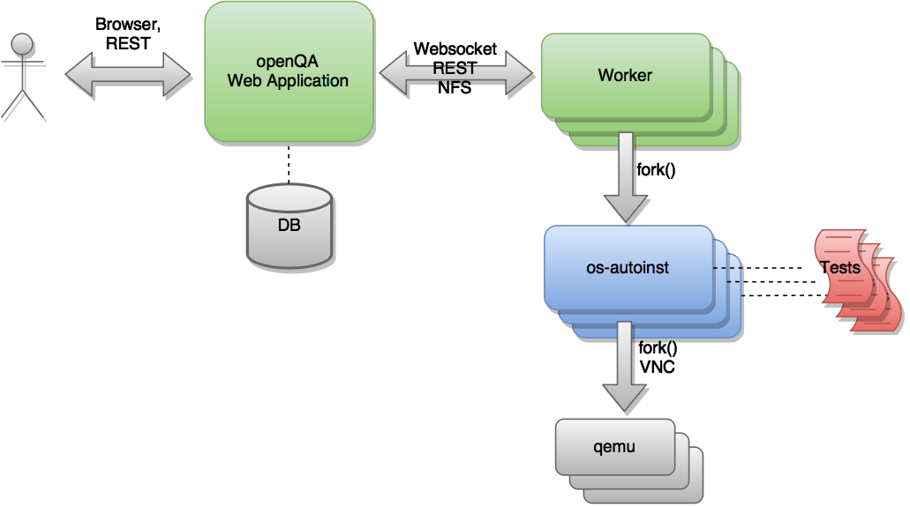

# openQA 框架调研报告


## 1. 介绍

openQA 是一个自动化测试工具，可以测试操作系统的整个安装过程。 它使用虚拟机重现该过程，检查每一步的输出并发送一些命令，然后继续下一步。 openQA 可以检查系统是否可以安装，它是否在实时模式下正常工作，应用程序是否工作或系统是否按预期响应不同的安装选项和命令。

openQA 可以针对操作系统的每个修订版运行多种测试组合，报告针对硬件配置、安装选项和操作系统变体的每种组合检测到的错误。




<center>openQA 架构图</center>


openQA的大致结构图如上图所示。测试引擎的核心是一个名为“os-autoinst”（蓝色）的独立应用程序。 在每次执行中，此应用程序都会创建一个虚拟机并使用它来运行一组测试脚本（红色）。 “os-autoinst”生成视频、屏幕截图和包含详细结果的 JSON 文件。

另一方面，“openQA”（绿色）提供基于 Web 的用户界面和基础架构，以分布式方式运行“os-autoinst”。 Web 界面还提供了一个基于 JSON 的类似 REST 的 API，用于外部脚本编写和工作程序使用。 工作人员从 openQA 获取数据和输入文件，供 os-autoinst 运行测试。 一个主机系统可以运行多个 worker。 openQA Web 应用程序负责在工作人员之间分配测试工作。 Web 应用程序和 worker 可以在同一台机器上运行，也可以在同一网络或分布式的多台机器上通过网络连接。 在云中运行 Web 应用程序和工作人员是完全可能的。

openQA 最重要的特性之一是它可用于测试多种操作和配置的组合。 对于这些组合中的每一个，系统都会创建一个虚拟机，执行特定步骤并返回总体结果。 每一次处决都被称为“工作”。 每个作业都标有一个数字标识符，并有几个相关的“设置”来驱动它的行为。


## 2. 测试原理

openQA 了解虚拟机状态的主要机制之一是检查机器“屏幕”中是否存在某些元素。 这是使用屏幕和所谓的“needle”之间的模糊图像匹配来执行的。 needle 指定了要搜索的元素和用于决定在任何时候应该使用哪些 needle 的标签列表。

needle由 PNG 格式的完整屏幕截图和包含相关数据的同名 json 文件（例如 foo.png 和 foo.json）组成，例如完整屏幕截图中的哪些区域是相关的或提到的标签列表。

json文件示例如下：

```json
`{
   "area" : [
      {
         "xpos" : INTEGER,
         "ypos" : INTEGER,
         "width" : INTEGER,
         "height" : INTEGER,
         "type" : ( "match" | "ocr" | "exclude" ),
         "match" : INTEGER, // 0-100. similarity percentage
      },
      ...
   ],
   "tags" : [
      STRING, ...
   ]
}`
```

区域分为三种：

**常规区域**定义了屏幕截图的相关部分。他们必须与指定的物体有一定的百分比相似度。 常规区域在针编辑器中显示为绿色框，在针视图中显示为绿色或红色框（匹配区域为绿色，不匹配区域为红色）。

**OCR 区域**定义了屏幕截图的相关部分。匹配中使用OCR算法，在needle编辑器中，OCR 区域显示为橙色框。 要将needle编辑器中的常规区域变成 OCR 区域，请双击相关区域两次。 请注意，这种needle很少使用。

**排除区域**可用于忽略部分参考图片。 在needle编辑器中，排除区域显示为红色框。 要将needle编辑器中的常规区域变成排除区域，请双击相关区域。 在needle视图中，排除区域显示为灰色框。


## 3. openQA执行过程

#### **测试 openSUSE / Fedora**

我们可以从测试 openSUSE 或 Fedora开始，因为它们已设置好一切并准备好了简化的初始部署。 

###### 获取tests和needles

首先需要进行实际测试。 可以从 GitHub 获取 openSUSE 测试和针（预期结果）。 它属于 /var/lib/openqa/tests/opensuse 目录。 为了使它更容易，你可以运行

`/usr/share/openqa/script/fetchneedles`
这会将测试下载到正确的位置并设置正确的权限。

Fedora 的测试也在 git 中。 要使用它们，你可以：

```bash
cd /var/lib/openqa/share/tests
mkdir fedora
cd fedora
git clone https://pagure.io/fedora-qa/os-autoinst-distri-fedora.git
./templates --clean
cd ..
chown -R geekotest fedora/
```

###### 获取 openQA 配置

要配置所有内容以实际运行测试，可以在管理界面中设置很多选项。如果您打算使用上一节中提到的测试来测试 openSUSE Factory，最简单的入门方法是使用以下命令：

```bash
/var/lib/openqa/share/tests/opensuse/products/opensuse/templates [--apikey API_KEY] [--apisecret API_SECRET]
```

这将加载在 openSUSE production openQA 的某个时间点使用的一些默认设置。因此，这些应该与 openSUSE 测试和针头一起工作得相当好。此脚本使用 /usr/share/openqa/script/openqa-load-templates，请考虑阅读其帮助页面 (--help) 以获取有关可能的额外参数的文档。

对于 Fedora，类似地，您可以调用：

```bash
/var/lib/openqa/share/tests/fedora/templates [--apikey API_KEY] [--apisecret API_SECRET]
```

一些 Fedora 测试需要特殊的硬盘映像出现在 /var/lib/openqa/share/factory/hdd/fixed 中。 createhdds 存储库中的 createhdds.py 脚本可用于创建这些。有关详细信息，请参阅该存储库中的文档。

###### 添加新的 ISO 进行测试

要开始测试新的 ISO，请将其放入 /var/lib/openqa/share/factory/iso 并调用以下命令：

```bash
# Run the first test
openqa-cli api -X POST isos \
         ISO=openSUSE-Factory-NET-x86_64-Build0053-Media.iso \
         DISTRI=opensuse \
         VERSION=Factory \
         FLAVOR=NET \
         ARCH=x86_64 \
         BUILD=0053
```

如果您的 openQA 未在“localhost”上的端口 80 上运行，您可以添加选项 --host=http://otherhost:6666 以指定不同的端口或主机。

###### 警告

在“客户端”命令中仅使用 ISO 文件名。 您必须将该文件放在 /var/lib/openqa/share/factory/iso 中。 您不能将文件放在别处并在命令中指定其路径。 但是，openQA 还支持从受信任域远程下载资产的功能。
对于 Fedora，示例运行可能是：

```bash
# Run the first test
openqa-cli api -X POST isos \
         ISO=Fedora-Everything-boot-x86_64-Rawhide-20160308.n.0.iso \
         DISTRI=fedora \
         VERSION=Rawhide \
         FLAVOR=Everything-boot-iso \
         ARCH=x86_64 \
         BUILD=Rawhide-20160308.n.0
```


## 4. 参考

- [openQA教程](https://github.com/os-autoinst/openQA/blob/master/docs/GettingStarted.asciidoc)

- [openQA官方文档](http://open.qa/documentation/)
